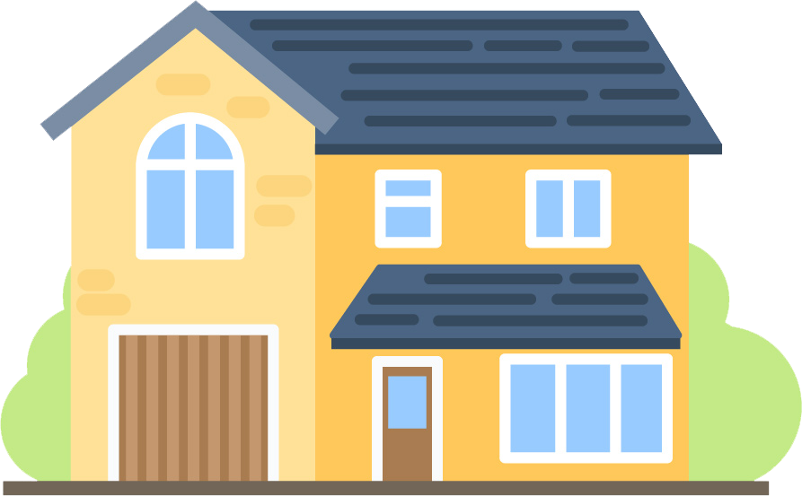

# Pozicovaní CSS procvičování: stavba domu

## :exclamation::exclamation: Zadání :exclamation::exclamation:
1) Sestavte z jednotlivých obrázků dům, který je vidět níže
2) Pokud jste použili relativní pozicování, použijte absolutní a naopak

## Řešení 

